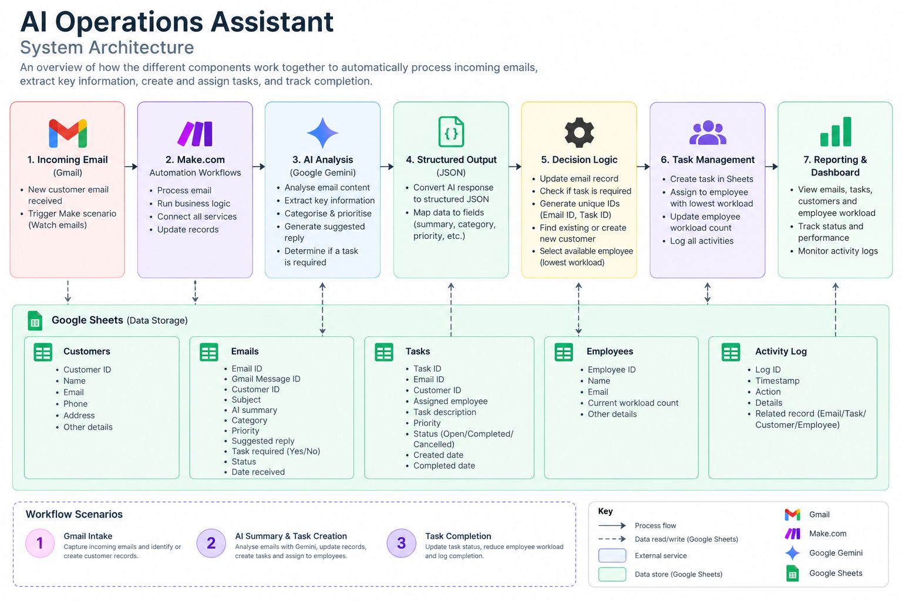
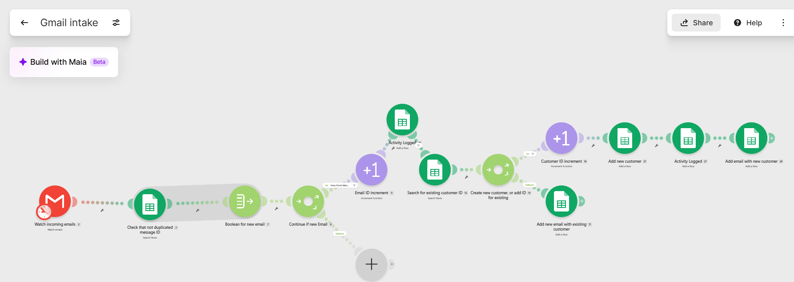
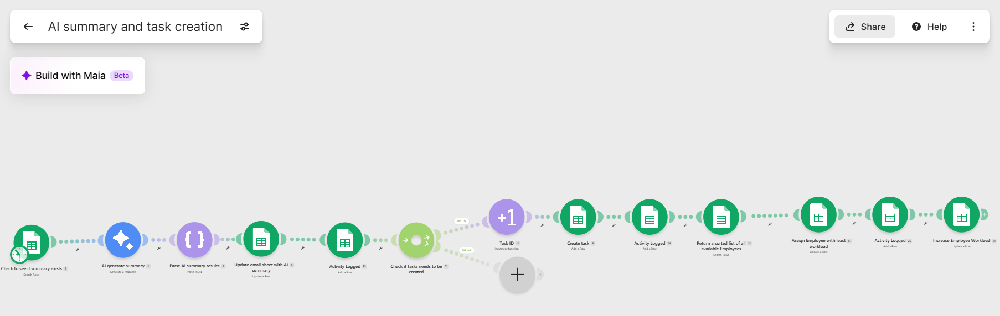
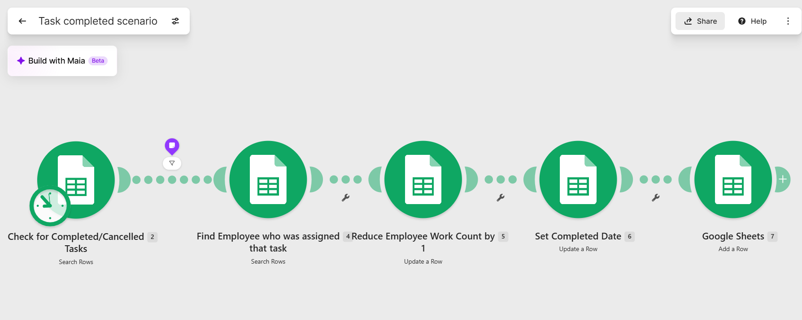
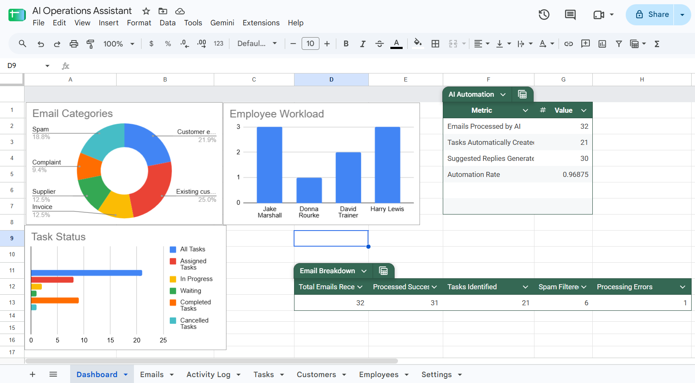

# AI Operations Assistant

An AI-assisted email operations system that automatically processes incoming customer emails, extracts key information, categorises and prioritises messages, generates suggested replies, creates actionable tasks, and distributes work across employees based on current workload.

## Project Overview

AI Operations Assistant is a fictional business operations system I created to explore how AI and workflow automation can reduce the manual effort involved in managing a shared customer inbox.

The system combines Gmail, Google Sheets, Make.com and Google Gemini to transform incoming emails into structured operational data. Messages are automatically captured, analysed by AI, linked to customer records, and converted into tasks when action is required.

The workflow also tracks employee workload and automatically assigns new tasks to the employee with the lowest current workload, creating a simple automated task distribution system.

## Business Problem

Businesses receiving customer enquiries through shared email inboxes often rely on employees to manually:

- Review and interpret incoming emails
- Identify the customer associated with each message
- Categorise and prioritise requests
- Determine whether follow-up action is required
- Create and assign internal tasks
- Draft responses
- Track employee workload
- Maintain accurate operational records

This creates repetitive administrative work and can lead to inconsistent prioritisation, delayed responses, missed tasks, and uneven distribution of work between employees.

The goal of this project was to design an automated workflow that uses AI to interpret incoming emails and convert unstructured messages into structured, actionable operational data.

## Solution

The system uses Make.com as the automation layer, Google Sheets as the operational data store, Gmail as the email source, and Google Gemini for AI-assisted email analysis.

The automated workflow:

- Captures new incoming emails from Gmail
- Prevents duplicate processing using the Gmail Message ID
- Identifies existing customers or creates new customer records
- Stores incoming emails in a central operational database
- Sends email content to Google Gemini for analysis
- Converts the AI response into structured JSON data
- Categorises and summarises each email
- Assigns a priority level
- Generates a suggested response
- Determines whether an internal task is required
- Automatically creates tasks when action is needed
- Assigns tasks to the available employee with the lowest workload
- Updates employee workload as tasks are assigned and completed
- Maintains an activity log for workflow traceability
- Provides dashboard reporting across email processing, task status and employee workload

## System Architecture

The system is built around three connected automation workflows that manage the lifecycle of an incoming customer email from initial capture through AI analysis, task assignment, and completion.

### Core Technologies

- **Make.com** — Workflow orchestration and business logic
- **Gmail** — Incoming customer email source
- **Google Gemini** — AI-powered email analysis and structured information extraction
- **Google Sheets** — Operational data store for customers, emails, tasks, employees, and activity records

## Automation Workflows

The system is divided into three automation scenarios, with each workflow responsible for a specific stage of the email and task lifecycle.

### 1. Gmail Intake & Customer Identification

The first workflow captures incoming emails and creates the records required for further processing.

When a new email is received, the workflow:

1. Captures the incoming message from Gmail
2. Checks the Gmail Message ID to prevent the same email from being processed more than once
3. Generates a unique Email ID
4. Searches the customer database for the sender
5. Creates a new customer record when no matching customer exists
6. Links the email to either the new or existing customer
7. Stores the email and customer relationship in Google Sheets
8. Records workflow activity for traceability

### 2. AI Email Analysis, Task Creation & Assignment

The second workflow processes captured emails using Google Gemini and determines whether further action is required.

The workflow:

1. Identifies emails requiring AI processing
2. Sends the email content to Google Gemini for analysis
3. Parses the AI response into structured JSON
4. Updates the email record with the generated summary, category, priority, suggested reply, and task requirement
5. Records the processing activity in the activity log
6. Checks whether the email requires an internal task
7. Generates a unique Task ID when action is required
8. Creates the task in the task database
9. Searches for available employees and sorts them by current workload
10. Assigns the task to the employee with the lowest workload
11. Updates the employee's current task count
12. Records the assignment in the activity log

### 3. Task Completion & Workload Update

The final workflow manages completed and cancelled tasks and keeps employee workload information accurate.

When a task reaches a completed or cancelled state, the workflow:

1. Identifies the relevant task
2. Finds the employee assigned to the task
3. Reduces the employee's current workload count
4. Records the task completion date
5. Adds the workflow event to the activity log

This ensures that employee workload data remains current and can be used when assigning future tasks.

## Dashboard & Reporting

Operational data generated by the workflows is consolidated into a Google Sheets dashboard, providing visibility into email processing, task management, and employee workload.

### AI Automation Metrics

The dashboard tracks key indicators of how much operational work is being handled by the automated system, including:

- Emails processed by AI
- Tasks automatically created
- Suggested replies generated
- Overall automation rate

### Email Processing

Email processing metrics provide visibility into:

- Total emails received
- Emails processed successfully
- Tasks identified from incoming emails
- Spam filtered
- Processing errors
- Email categories

### Task Management

Task reporting shows the current distribution of work across:

- New
- Assigned
- In Progress
- Waiting
- Completed
- Cancelled

### Employee Workload

The dashboard tracks each employee's current workload, making it possible to monitor task distribution and support the workload-based assignment logic used by the automation.

### Visual Reporting

The dashboard includes visual reporting for:

- Emails by category
- Tasks by status
- Employee workload

This provides a simple operational view of how incoming communication is being processed and how resulting work is distributed across the team.

